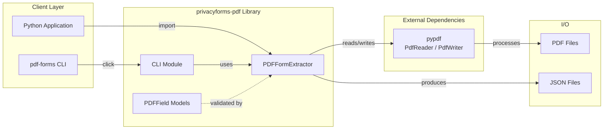
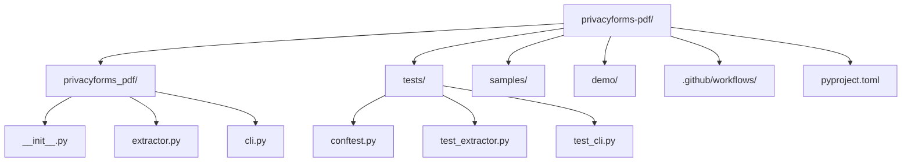
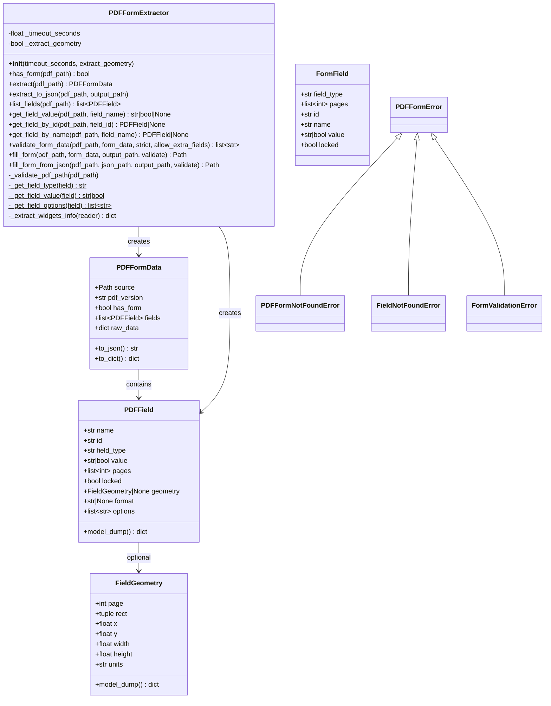
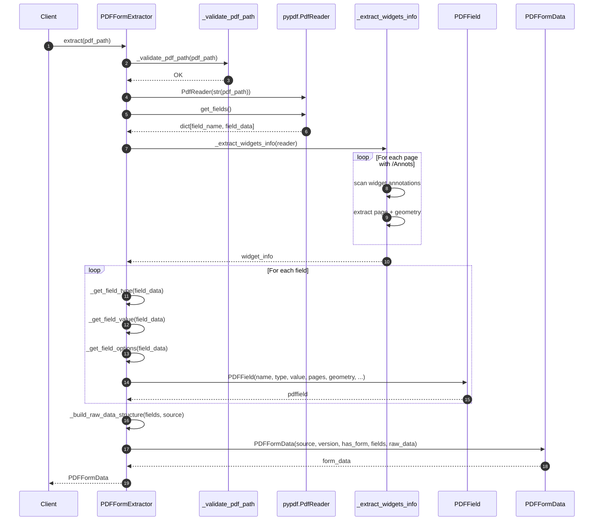
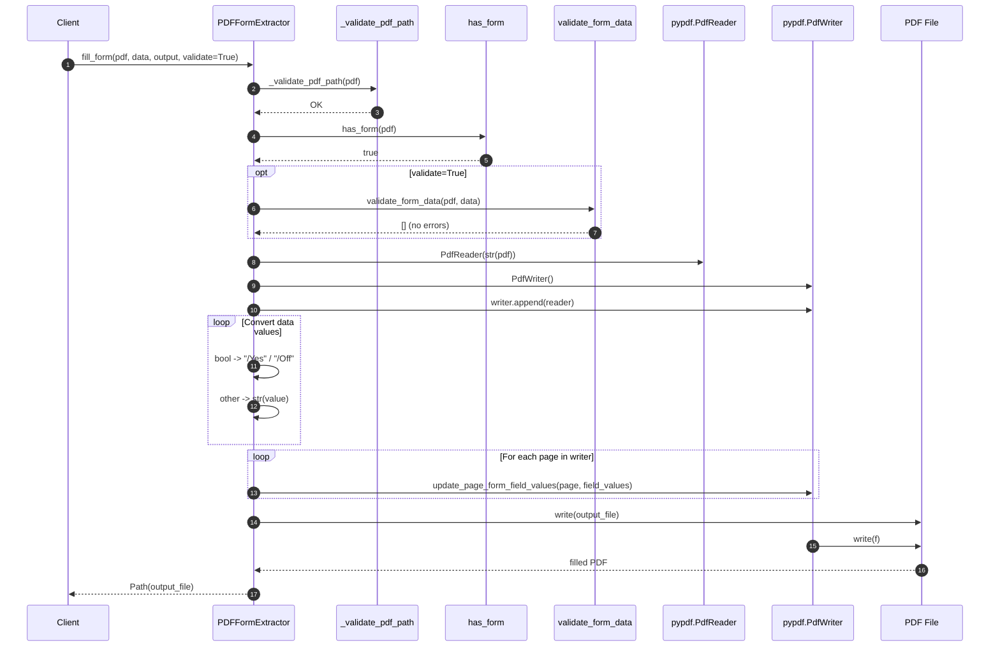
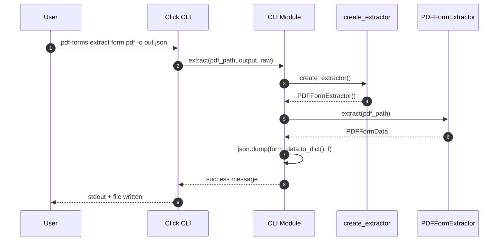
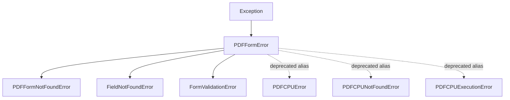

# privacyforms-pdf — Technical Documentation

> **Version:** 0.1.3  
> **Scope:** API reference, architecture overview, data models, and execution workflows.

---

## Table of Contents

1. [Architecture Overview](#architecture-overview)
2. [Package Structure](#package-structure)
3. [Data Models](#data-models)
4. [Core Workflows](#core-workflows)
5. [CLI Architecture](#cli-architecture)
6. [Error Handling](#error-handling)
7. [Diagram Assets](#diagram-assets)

---

## Architecture Overview

`privacyforms-pdf` is a pure-Python library built on top of [`pypdf`](https://pypdf.readthedocs.io/). It exposes both a programmatic API (`PDFFormExtractor`) and a command-line interface (`pdf-forms`). All PDF I/O is delegated to `pypdf`; the library itself contains no native extensions.

### Component Diagram



### Package Structure



---

## Data Models

### Class Diagram



### Model Descriptions

| Model | Purpose |
|-------|---------|
| `PDFFormExtractor` | Central orchestrator for reading, validating, and writing PDF forms. |
| `PDFFormData` | Container for extracted form metadata (version, fields, raw data). |
| `PDFField` | Pydantic v2 model representing a single form field with optional geometry. |
| `FieldGeometry` | Pydantic v2 model holding a field’s bounding box and page location. |
| `FormField` | Legacy plain class kept for backwards compatibility. |

---

## Core Workflows

### Form Extraction Sequence

The `extract()` method performs a two-pass scan:
1. **Field scan** via `PdfReader.get_fields()`
2. **Widget scan** via page annotations (`/Annots`) to resolve page numbers and geometry.



### Form Filling Sequence

Form filling creates a **new PDF stream** via `PdfWriter.append(reader)` and updates widget values page-by-page.



---

## CLI Architecture

The CLI is implemented with **Click** and delegates all heavy work to `PDFFormExtractor`. Each subcommand is a thin wrapper that:
1. Instantiates an extractor via `create_extractor()`
2. Calls the corresponding library method
3. Formats and prints the result (JSON, table, or plain text)
4. Translates library exceptions into `click.ClickException`

### CLI Command Flow



### Command Mapping

| CLI Command | Library Method | Output Format |
|-------------|----------------|---------------|
| `check` | — | Human-readable status |
| `info <pdf>` | `has_form()` | `✓` / `✗` message |
| `extract <pdf>` | `extract()` | JSON (stdout or file) |
| `list-fields <pdf>` | `list_fields()` | Aligned table |
| `get-value <pdf> <field>` | `get_field_value()` | Plain value |
| `fill-form <pdf> <json>` | `fill_form_from_json()` | Filled PDF file |

---

## Error Handling

All library exceptions inherit from `PDFFormError`. The CLI catches these and re-raises them as `click.ClickException`, ensuring a clean exit code and user-friendly message.

### Exception Hierarchy



### Exception Usage Matrix

| Exception | Raised By | Typical Cause |
|-----------|-----------|---------------|
| `PDFFormNotFoundError` | `extract()`, `fill_form()` | PDF contains no AcroForm. |
| `FormValidationError` | `fill_form()` with `validate=True` | Unknown field, type mismatch, or strict-mode missing field. |
| `FieldNotFoundError` | *(public API)* | Explicit lookup by name/ID failed. |
| `PDFCPUError` aliases | *(deprecated)* | Backwards compatibility with pre-pypdf versions. |

---

## Diagram Assets

For online documentation and GitHub rendering, SVG exports of every diagram are provided in the `docs/diagrams/` directory.

| Diagram | Markdown Embed | SVG File |
|---------|---------------|----------|
| Component Diagram | above | `diagrams/architecture-components.svg` |
| Package Structure | above | `diagrams/package-structure.svg` |
| Class Diagram | above | `diagrams/class-diagram.svg` |
| Extraction Sequence | above | `diagrams/sequence-extract.svg` |
| Filling Sequence | above | `diagrams/sequence-fill.svg` |
| CLI Sequence | above | `diagrams/sequence-cli.svg` |
| Exception Hierarchy | above | `diagrams/exception-hierarchy.svg` |

> **Tip:** If your documentation platform (e.g., MkDocs, Docusaurus) does not support Mermaid natively, reference the SVG files directly with standard Markdown image syntax:
> ```markdown
> 
> ```
